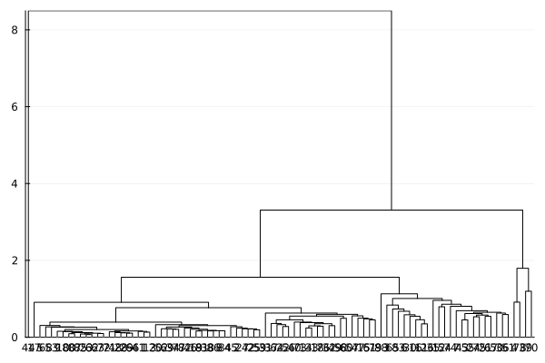

GWAS - cpgs
================
Nicoló Foppa Pedretti

``` julia
using DataFrames, Statistics, LinearAlgebra, Plots, Clustering, TSne, DecisionTree, MLDataUtils
using Distributions, StatsPlots, StatsBase, FillArrays, Arrow, UMAP, Distances, MLBase
```

``` julia
df = DataFrame(Arrow.Table("C:/Users/nicol/Documents/Datasets/GSE71678/Data/processed_data/GSE71678_cov_original.arrow"));
```

``` julia
cpgs = DataFrame(Arrow.Table("C:/Users/nicol/Documents/Datasets/GSE71678/Data/processed_data/GSE71678_cpgs_original.arrow"))
```

``` julia
cpgs = cpgs[:,vcat("ID_REF",df.ID)];
```

``` julia
x = Matrix{Float64}(cpgs[:,2:size(cpgs,2)]);
tx = Matrix(x');
```

``` julia
cpgs_stats = Matrix{Float64}(hcat(mean(x,dims = 2),
        std(x,dims = 2),
        [minimum(x[i,:]) for i in 1:size(x,1)],
        [maximum(x[i,:]) for i in 1:size(x,1)],
        [length(countmap(x[i,:])) for i in 1:size(x,1)],
        [length(countmap(x[i,:])) for i in 1:size(x,1)]/size(x,2)));
```

``` julia
size(x)
```

    (344348, 343)

``` julia
println("cg   - ",sum(contains.(cpgs.ID_REF,"cg")))
println("ch.1 - ",sum(contains.(cpgs.ID_REF,"ch.1")))
println("ch.2 - ",sum(contains.(cpgs.ID_REF,"ch.2")))
println("ch.3 - ",sum(contains.(cpgs.ID_REF,"ch.3")))
println("ch.4 - ",sum(contains.(cpgs.ID_REF,"ch.4")))
println("ch.5 - ",sum(contains.(cpgs.ID_REF,"ch.5")))
println("ch.6 - ",sum(contains.(cpgs.ID_REF,"ch.6")))
println("ch.7 - ",sum(contains.(cpgs.ID_REF,"ch.7")))
println("ch.8 - ",sum(contains.(cpgs.ID_REF,"ch.8")))
println("ch.9 - ",sum(contains.(cpgs.ID_REF,"ch.9")))
```

    cg   - 342088
    ch.1 - 1037
    ch.2 - 374
    ch.3 - 119
    ch.4 - 142
    ch.5 - 123
    ch.6 - 133
    ch.7 - 127
    ch.8 - 117
    ch.9 - 88

``` julia
R = pairwise(Euclidean(), x[contains.(cpgs.ID_REF,"ch.9"),:], dims=1);
```

``` julia
hc = hclust(R, linkage=:average)
plot(hc)
```



``` julia
countmap(cutree(hc; k = 4))
```

    Dict{Int64, Int64} with 4 entries:
      4 => 1
      2 => 2
      3 => 2
      1 => 83
