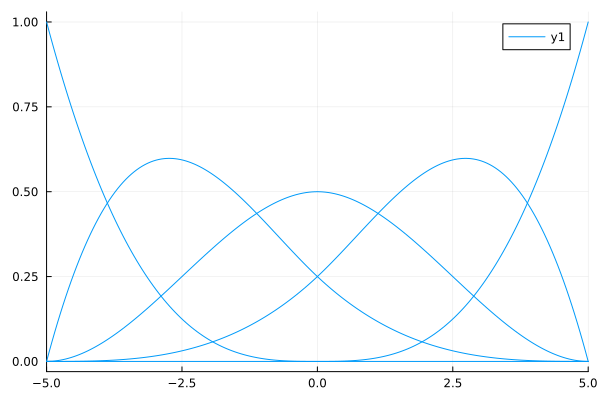
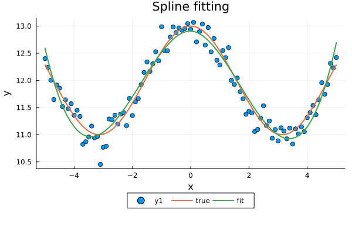
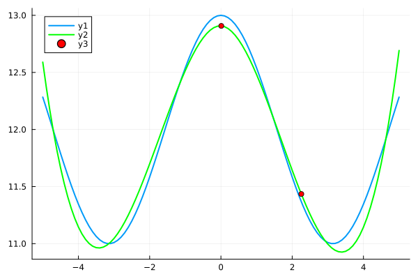

Splines + linear algebra for data analysis
================
Nicoló Foppa Pedretti
5/26/23

# Introduction

Spline fitting is a mathematical technique used to approximate a curve
or function using a collection of polynomial segments known as splines.
The goal is to find a smooth and flexible curve that passes close to a
given set of data points.

Here’s a step-by-step description of spline fitting:

1.  **Data points:** Begin with a set of data points that you want to
    approximate with a spline curve. Let’s denote the data points as
    "),
    where 
    represents the independent variable (e.g., time, distance) and
     represents
    the corresponding dependent variable (e.g., temperature, velocity).

2.  **Knots:** Choose a set of knots, which are points where the
    polynomial segments of the spline connect. Typically, the knots are
    selected to be the same as the data points, but they can also be
    chosen strategically to control the behavior of the spline. Let’s
    denote the knots as
    ").

3.  **Piecewise polynomial segments:** Divide the interval between each
    pair of consecutive knots into segments. Each segment will be
    represented by a polynomial function. The most common choice is to
    use cubic polynomials (degree 3) because they provide a good balance
    between flexibility and smoothness.

4.  **Interpolation conditions:** To determine the coefficients of the
    polynomials and ensure that the spline curve passes through the data
    points, we impose interpolation conditions. These conditions require
    that the value of the spline at each data point matches the
    corresponding dependent variable value. In other words, we want the
    spline to interpolate the data.

5.  **Smoothness conditions:** To ensure a smooth and continuous curve,
    additional conditions are imposed. The most common condition is to
    require that the first and second derivatives of adjacent
    polynomials match at the knots. This ensures that the curve has no
    abrupt changes or discontinuities.

6.  **Solving the system:** By combining the interpolation and
    smoothness conditions, we obtain a system of linear equations. The
    unknowns in the system are the coefficients of the polynomials.
    Solve this system to determine the coefficients and obtain the
    specific polynomial functions for each segment.

7.  **Evaluating the spline:** Once the coefficients are known, the
    spline curve can be evaluated at any desired point within the range
    of the data. This allows you to estimate the corresponding dependent
    variable value.

Spline fitting provides a flexible and accurate way to approximate
curves based on a given set of data points. The resulting spline curve
can capture both local and global features of the data, while
maintaining smoothness and continuity.

# Basis Spline

``` julia
using DataFrames, Statistics, LinearAlgebra, Plots, CategoricalArrays 
using Parquet, StatsPlots, StatsBase, BasicBSpline, Optim, Distributions
```

``` julia
# k = KnotVector([-5.0, -5.0, -5.0, -5.0, -4.0, -3.0, -2.0, -1.0,
#                  0.0, 1.0, 2.0, 3.0, 4.0, 5.0, 5.0, 5.0, 5.0])
k = KnotVector([-5.0, -5.0, -5.0, -5.0, 0.0, 5.0, 5.0, 5.0, 5.0])

# Write a function to generate the proper set of knots -- 

P0 = BSplineSpace{0}(k) # 0th degree piecewise polynomial space
P1 = BSplineSpace{1}(k) # 1st degree piecewise polynomial space
P2 = BSplineSpace{2}(k) # 2nd degree piecewise polynomial space
P3 = BSplineSpace{3}(k) # 3rd degree piecewise polynomial space
P4 = BSplineSpace{4}(k) # 4th degree piecewise polynomial space
```

    BSplineSpace{4, Float64, KnotVector{Float64}}(KnotVector([-5.0, -5.0, -5.0, -5.0, 0.0, 5.0, 5.0, 5.0, 5.0]))

``` julia
plot(P3, xlims=(-5,5))
```



# Example

``` julia
bs = bsplinebasis.(P3,1:5,(-5:0.1:5)');
a = randn(5)
x = collect(-5:0.1:5)
y_true = cos.(x) .+ 12 #12.5 .+ 0.1 * x + bs' * a
y = y_true + 0.2 * randn(101);
```

``` julia
# e(b) = sum((y - (b[1] .+ b[2] * x + bs' * b[3:16])).^2)   
e(b) = sum((y - (bs' * b)).^2)   
```

    e (generic function with 1 method)

``` julia
# opt_model = optimize(e, zeros(16), LBFGS());
opt_model = optimize(e, zeros(5), LBFGS());
betas = opt_model.minimizer;
```

``` julia
#y_fit = betas[1] .+ betas[2] * x + bs' * betas[3:16];
y_fit = bs' * betas;
```

``` julia
scatter(x,y)
plot!(x,[y_true,y_fit], lw = [2 2], label=["true" "fit"])
plot!(legend=:outerbottom, legendcolumns=3)
title!("Spline fitting")
xlabel!("x")
ylabel!("y")
```



# New data

Based on the spline fitted above we want to find tha value of new
. The main idea is that
we have to decompose the new point into the basis of functions as
follow:

 \longmapsto Y \\
X_{new} \longmapsto bs(X_{new}) \longmapsto Y_{new}")

``` julia
bsp = bsplinebasis.(P3,1:5,[0.01 2.256])
```

    5×2 Matrix{Float64}:
     0.0       0.0
     0.248503  0.0413221
     0.499994  0.286484
     0.251503  0.580338
     8.0e-9    0.0918559

``` julia
y_new = bsp' * betas
```

    2-element Vector{Float64}:
     12.907490754042904
     11.435063333338347

``` julia
#scatter(x,y)
plot(x,y_true, linewidth = 2)
plot!(x,y_fit, linewidth = 2, color = "lime")
scatter!([0.01,2.256],y_new, color = "red")
```


