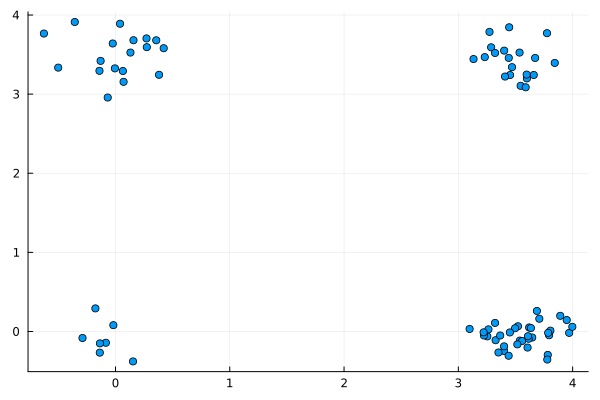
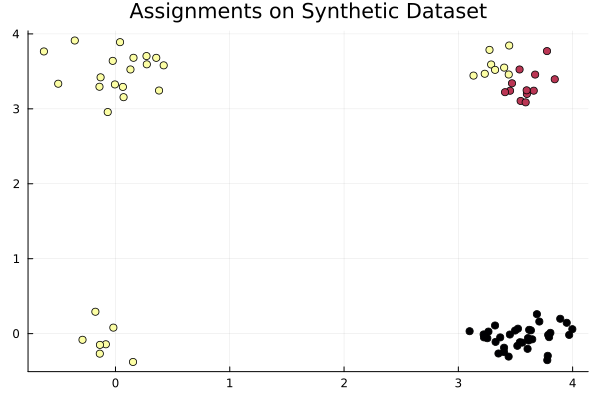

::: {.cell execution_count=1}
``` {.julia .cell-code}
using DataFrames, Statistics, LinearAlgebra, Plots, CategoricalArrays
using Distributions, StatsPlots, StatsBase
using Turing
using Turing.RandomMeasures
```
:::


::: {.cell}
``` {.julia .cell-code}
@model function infiniteGMM(x)
    # Hyper-parameters, i.e. concentration parameter and parameters of H.
    α = 1.0
    μ0 = 0.0
    σ0 = 1.0

    # Define random measure, e.g. Dirichlet process.
    rpm = DirichletProcess(α)

    # Define the base distribution, i.e. expected value of the Dirichlet process.
    H = Normal(μ0, σ0)

    # Latent assignment.
    z = tzeros(Int, 10) #length(x))

    # Locations of the infinitely many clusters.
    μ = tzeros(Float64, 0)

    for i in 1:10 #length(x)

        # Number of clusters.
        K = maximum(z)
        nk = Vector{Int}(map(k -> sum(z .== k), 1:K))

        # Draw the latent assignment.
        z[i] ~ ChineseRestaurantProcess(rpm, nk)

        # Create a new cluster?
        if z[i] > K
            push!(μ, 0.0)

            # Draw location of new cluster.
            μ[z[i]] ~ H
        end

        # Draw observation.
        x[i] ~ Normal(μ[z[i]], 1.0)
    end
end
```
:::


::: {.cell}
``` {.julia .cell-code}
# MCMC sampling
data = Matrix{Float64}()
iterations = 1000
model_fun = infiniteGMM(data);
chain = sample(model_fun, SMC(), iterations)
```
:::


::: {.cell execution_count=47}
``` {.julia .cell-code}
using FillArrays
# Define Gaussian mixture model.
w = [0.1, 0.4, 0.3, 0.2]
#μ = [-3.5, 0.5, 10.0, 4.8]
μ = [[0.0, 0.0], [3.5, 0.0], [0.0, 3.5], [3.5, 3.5]]
#mixturemodel = MixtureModel([MvNormal(Fill(μₖ, 2), 0.2*I) for μₖ in μ], w)
mixturemodel = MixtureModel([MvNormal(μₖ, 0.06*I) for μₖ in μ], w)

# We draw the data points.
N = 80
xa = rand(mixturemodel, N);
```
:::


::: {.cell execution_count=48}
``` {.julia .cell-code}
scatter(xa[1,:],xa[2,:], label = "")
```

::: {.cell-output .cell-output-display execution_count=48}
{}
:::
:::


::: {.cell execution_count=31}
``` {.julia .cell-code}
K = 4
a = filldist(MvNormal(Zeros(2), I),K)
```

::: {.cell-output .cell-output-display execution_count=31}
```
DistributionsAD.VectorOfMultivariate{Continuous, ZeroMeanIsoNormal{Tuple{Base.OneTo{Int64}}}, Fill{ZeroMeanIsoNormal{Tuple{Base.OneTo{Int64}}}, 1, Tuple{Base.OneTo{Int64}}}}(dists=Fill(ZeroMeanIsoNormal(
dim: 2
μ: Zeros(2)
Σ: [1.0 0.0; 0.0 1.0]
)
, 4))
```
:::
:::


::: {.cell execution_count=34}
``` {.julia .cell-code}
a.dists[2]
```

::: {.cell-output .cell-output-display execution_count=34}
```
ZeroMeanIsoNormal(
dim: 2
μ: Zeros(2)
Σ: [1.0 0.0; 0.0 1.0]
)
```
:::
:::


::: {.cell execution_count=49}
``` {.julia .cell-code}
@model function gaussian_mixture_model4(x)
    # Draw the parameters for each of the K=2 clusters from a standard normal distribution.
    K = 4
    μ ~ filldist(MvNormal(Zeros(2), I),K)
    #μ ~ Normal(0.0, 1.0)
    #μ₂ ~ MvNormal(Zeros(K), I)

    # Draw the weights for the K clusters from a Dirichlet distribution with parameters αₖ = 1.
    w ~ Dirichlet(K, 1.0)
    # Alternatively, one could use a fixed set of weights.
    # w = fill(1/K, K)

    # Construct categorical distribution of assignments.
    distribution_assignments = Categorical(w)

    # Construct multivariate normal distributions of each cluster.
    D, N = size(x)
    #distribution_clusters = [MvNormal(Fill(μₖ, D), I) for μₖ in μ]
    distribution_clusters = [MvNormal(m, I) for m in eachcol(μ)]

    # Draw assignments for each datum and generate it from the multivariate normal distribution.
    k = Vector{Int}(undef, N)
    for i in 1:N
        k[i] ~ distribution_assignments
        x[:, i] ~ distribution_clusters[k[i]]
    end

    return k
end
```

::: {.cell-output .cell-output-display execution_count=49}
```
gaussian_mixture_model4 (generic function with 2 methods)
```
:::
:::


::: {.cell execution_count=50}
``` {.julia .cell-code}
model = gaussian_mixture_model4(xa);
```
:::


::: {.cell execution_count=51}
``` {.julia .cell-code}
D, N = size(xa)
println(D)
println(N)
```

::: {.cell-output .cell-output-stdout}
```
2
80
```
:::
:::


::: {.cell}
``` {.julia .cell-code}
sampler = Gibbs(PG(100, :k), HMC(0.05, 10, :μ, :w))
nsamples = 10000
nchains = 3
#chains = sample(model, SMC(), nsamples);
@time chains = sample(model, sampler, MCMCThreads(), nsamples, nchains);
```
:::


::: {.cell execution_count=58}
``` {.julia .cell-code}
chains
```

::: {.cell-output .cell-output-display execution_count=58}

::: {.ansi-escaped-output}

```{=html}
<pre>Chains MCMC chain (1000×93×3 Array{Float64, 3}):
Iterations        = 1:1:1000
Number of chains  = 3
Samples per chain = 1000
Wall duration     = 6127.87 seconds
Compute duration  = 17232.5 seconds
parameters        = μ[1,1], μ[2,1], μ[1,2], μ[2,2], μ[1,3], μ[2,3], μ[1,4], μ[2,4], w[1], w[2], w[3], w[4], k[1], k[2], k[3], k[4], k[5], k[6], k[7], k[8], k[9], k[10], k[11], k[12], k[13], k[14], k[15], k[16], k[17], k[18], k[19], k[20], k[21], k[22], k[23], k[24], k[25], k[26], k[27], k[28], k[29], k[30], k[31], k[32], k[33], k[34], k[35], k[36], k[37], k[38], k[39], k[40], k[41], k[42], k[43], k[44], k[45], k[46], k[47], k[48], k[49], k[50], k[51], k[52], k[53], k[54], k[55], k[56], k[57], k[58], k[59], k[60], k[61], k[62], k[63], k[64], k[65], k[66], k[67], k[68], k[69], k[70], k[71], k[72], k[73], k[74], k[75], k[76], k[77], k[78], k[79], k[80]
internals         = lp
Summary Statistics
 <span class="ansi-bold"> parameters </span> <span class="ansi-bold">    mean </span> <span class="ansi-bold">     std </span> <span class="ansi-bold"> naive_se </span> <span class="ansi-bold">    mcse </span> <span class="ansi-bold">     ess </span> <span class="ansi-bold">    rhat </span> <span class="ansi-bold"> es</span> ⋯
 <span class="ansi-bright-black-fg">     Symbol </span> <span class="ansi-bright-black-fg"> Float64 </span> <span class="ansi-bright-black-fg"> Float64 </span> <span class="ansi-bright-black-fg">  Float64 </span> <span class="ansi-bright-black-fg"> Float64 </span> <span class="ansi-bright-black-fg"> Float64 </span> <span class="ansi-bright-black-fg"> Float64 </span> <span class="ansi-bright-black-fg">   </span> ⋯
      μ[1,1]    2.3117    1.6254     0.0297    0.2177    6.0716    9.2641      ⋯
      μ[2,1]    1.2819    1.4952     0.0273    0.1991    6.1224    7.1075      ⋯
      μ[1,2]    2.2708    1.6103     0.0294    0.2102    6.5315    3.5364      ⋯
      μ[2,2]    1.2893    1.6629     0.0304    0.2160    6.9842    2.4146      ⋯
      μ[1,3]    0.3803    1.0375     0.0189    0.1256    7.2259    2.2992      ⋯
      μ[2,3]    1.0625    1.6221     0.0296    0.2148    6.2295    5.2934      ⋯
      μ[1,4]    1.0619    1.6197     0.0296    0.2131    6.2857    4.8568      ⋯
      μ[2,4]    2.1646    1.5930     0.0291    0.2093    6.3308    4.5058      ⋯
        w[1]    0.4017    0.1578     0.0029    0.0201    6.6830    3.1441      ⋯
        w[2]    0.2556    0.1536     0.0028    0.0199    6.8858    2.6415      ⋯
        w[3]    0.1619    0.1193     0.0022    0.0151    7.3477    2.1814      ⋯
        w[4]    0.1808    0.0929     0.0017    0.0112    7.5221    2.2371      ⋯
        k[1]    1.3370    0.4777     0.0087    0.0636    6.0804    8.6650      ⋯
        k[2]    1.3363    0.4788     0.0087    0.0638    6.1115    7.4075      ⋯
        k[3]    2.6670    1.1051     0.0202    0.1456    6.2338    5.2079      ⋯
        k[4]    1.3410    0.4873     0.0089    0.0641    6.2426    5.0914      ⋯
        k[5]    2.6043    1.2491     0.0228    0.1620    6.5228    3.4309      ⋯
        k[6]    2.5933    1.2537     0.0229    0.1661    6.2866    4.4343      ⋯
        k[7]    1.3400    0.4849     0.0089    0.0637    6.2371    5.1376      ⋯
        k[8]    2.5877    1.2525     0.0229    0.1670    6.1994    5.1564      ⋯
        k[9]    2.5960    1.2460     0.0227    0.1602    6.6406    3.1430      ⋯
       k[10]    2.5947    1.2515     0.0228    0.1649    6.3156    4.2696      ⋯
       k[11]    2.6413    1.1167     0.0204    0.1474    6.2467    5.0546      ⋯
      ⋮           ⋮         ⋮         ⋮          ⋮         ⋮         ⋮         ⋱
<span class="ansi-cyan-fg">                                                    1 column and 69 rows omitted</span>
Quantiles
 <span class="ansi-bold"> parameters </span> <span class="ansi-bold">    2.5% </span> <span class="ansi-bold">   25.0% </span> <span class="ansi-bold">   50.0% </span> <span class="ansi-bold">   75.0% </span> <span class="ansi-bold">   97.5% </span>
 <span class="ansi-bright-black-fg">     Symbol </span> <span class="ansi-bright-black-fg"> Float64 </span> <span class="ansi-bright-black-fg"> Float64 </span> <span class="ansi-bright-black-fg"> Float64 </span> <span class="ansi-bright-black-fg"> Float64 </span> <span class="ansi-bright-black-fg"> Float64 </span>
      μ[1,1]   -0.3102    0.1863    3.3469    3.5026    3.7471
      μ[2,1]   -0.3049   -0.0279    0.8598    3.1284    3.6385
      μ[1,2]   -0.6870    0.3560    3.2334    3.4473    3.7279
      μ[2,2]   -0.7888   -0.0885    0.2321    3.1902    3.5933
      μ[1,3]   -0.6948   -0.2149    0.0399    0.4020    3.3875
      μ[2,3]   -0.7163   -0.1822    0.2028    3.1372    3.6380
      μ[1,4]   -0.8067   -0.1293    0.1920    3.1403    3.6249
      μ[2,4]   -0.7491    0.2672    3.1028    3.3338    3.6698
        w[1]    0.1600    0.2553    0.4091    0.4836    0.7162
        w[2]    0.0076    0.1172    0.2537    0.3932    0.5097
        w[3]    0.0430    0.0811    0.1140    0.2163    0.4950
        w[4]    0.0131    0.0916    0.2046    0.2515    0.3265
        k[1]    1.0000    1.0000    1.0000    2.0000    2.0000
        k[2]    1.0000    1.0000    1.0000    2.0000    2.0000
        k[3]    1.0000    2.0000    3.0000    4.0000    4.0000
        k[4]    1.0000    1.0000    1.0000    2.0000    2.0000
        k[5]    1.0000    1.0000    3.0000    4.0000    4.0000
        k[6]    1.0000    1.0000    3.0000    4.0000    4.0000
        k[7]    1.0000    1.0000    1.0000    2.0000    2.0000
        k[8]    1.0000    1.0000    3.0000    4.0000    4.0000
        k[9]    1.0000    1.0000    3.0000    4.0000    4.0000
       k[10]    1.0000    1.0000    3.0000    4.0000    4.0000
       k[11]    1.0000    2.0000    2.0000    4.0000    4.0000
      ⋮           ⋮         ⋮         ⋮         ⋮         ⋮
<span class="ansi-cyan-fg">                                                 69 rows omitted</span>
</pre>
```

:::

:::
:::


::: {.cell execution_count=59}
``` {.julia .cell-code}
mdn = zeros(N)
for i in 1:N
    mdn[i] = median(chains[:,i+12,:])
end
```
:::


::: {.cell execution_count=60}
``` {.julia .cell-code}
countmap(mdn)
```

::: {.cell-output .cell-output-display execution_count=60}
```
Dict{Float64, Int64} with 3 entries:
  2.0 => 12
  3.0 => 33
  1.0 => 35
```
:::
:::


::: {.cell execution_count=62}
``` {.julia .cell-code}
@time scatter(
    xa[1,:],
    xa[2,:];
    legend=false,
    title="Assignments on Synthetic Dataset",
    zcolor=mdn,
)
```

::: {.cell-output .cell-output-stdout}
```
  0.000575 seconds (945 allocations: 97.781 KiB)
```
:::

::: {.cell-output .cell-output-display execution_count=62}
{}
:::
:::


